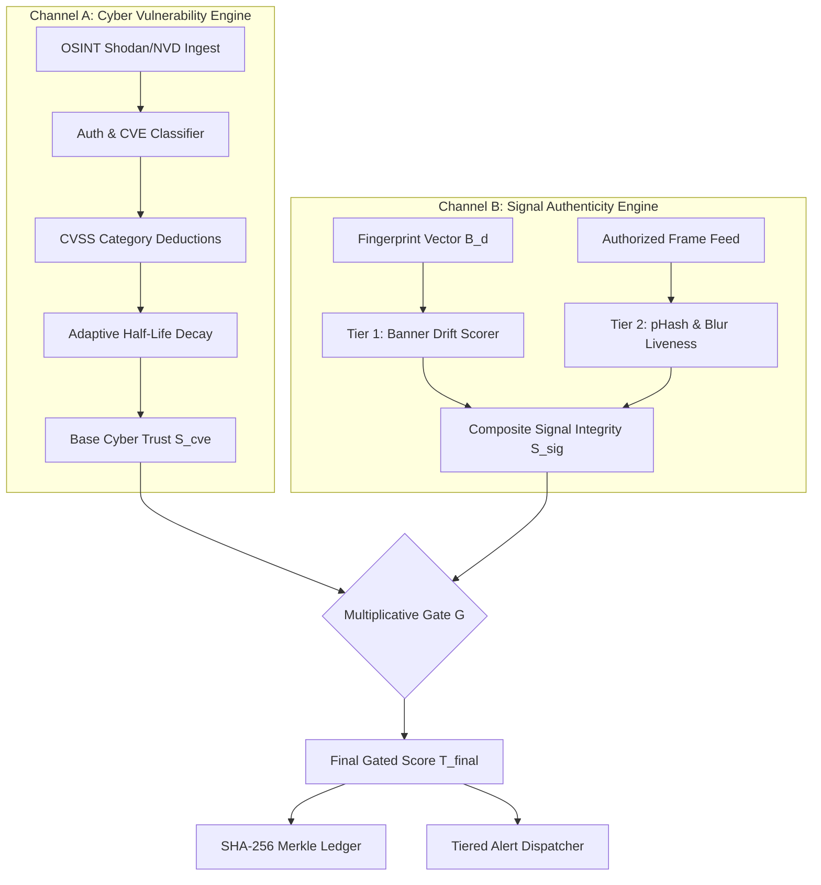

# Beyond CVE Scores: Integrity-Gated Dual-Channel Trust Fusion for OSINT-Discovered Surveillance Networks

**Authors**: Gokul, et al.  
**Academic Context**: Final Year B.Tech Major Project / Research Paper Draft  
**Target Tracks**: IEEE Workshop on Information Forensics & Security (WIFS), IEEE Conference on Communications and Network Security (CNS), ACM CCS Workshop on IoT Security, MDPI *IoT* / *Journal of Cybersecurity and Privacy*

---

## Abstract

Physical Security Information Management (PSIM) and automated command dispatch systems implicitly trust connected video surveillance streams as authentic sources of physical ground truth. However, millions of exposed Internet of Things (IoT) closed-circuit television (CCTV) cameras operate with outdated firmware, unauthenticated RTSP endpoints, and critical Common Vulnerabilities and Exposures (CVEs). Existing research treats computer-vision video analytics (tracking, Re-ID, tamper/forgery detection) and IoT cybersecurity (CVE severity weighting, Bayesian trust scoring, and reputation systems) as two disconnected silos. Consequently, a camera with a pristine CVE profile (patched firmware, authenticated endpoint) that is physically swapped with a low-resolution decoy or subjected to an RTSP loop/freeze attack will be rated as 100% trustworthy by cyber-trust models, while video pipelines remain oblivious to underlying device vulnerabilities.

In this paper, we propose **Integrity-Gated Dual-Channel Trust Fusion (IG-DCTF)**, an architecture that bridges this literature divide. IG-DCTF formulates device trustworthiness along two orthogonal, independently-gated axes: **Channel A (Cyber Vulnerability Posture)** and **Channel B (Signal & Feed Authenticity)**. To adhere strictly to ethical, passive-OSINT boundaries with zero outbound connections to discovered cameras, Channel B operates in two tiers: (i) **Tier 1 (Passive Banner-Fingerprint Drift)** computing multi-attribute distance over Shodan/Censys metadata (resolution, codec, HTTP server headers, open port Jaccard distance, and firmware string regression), and (ii) **Tier 2 (Frame-Level Visual Liveness)** computing rolling perceptual hash ($p\text{Hash}$) freeze detection and variance-of-Laplacian blur drift on authorized video streams.

We evaluate IG-DCTF across an expanded **130-scenario benchmark suite** (120 direct scoring scenarios + 10 protocol security scenarios), a dedicated **100-mutation synthetic banner drift corpus**, and an **80-scenario frame-level visual liveness corpus**. On direct scoring evaluation ($n=120$), IG-DCTF achieves **97.50% accuracy** (95% Wilson CI: $[0.93, 0.99]$) and **95.00% precision** ($[0.86, 0.98]$) with **100.0% recall** ($[0.94, 1.00]$) and **0.9744 F1**, outperforming CVE-only engines ($83.33\%$ accuracy, $74.03\%$ precision) by eliminating false-positive trust assignments on decoy and frozen feeds.

---

## 1. Introduction

Modern urban surveillance platforms increasingly couple computer vision models (such as YOLOv8 and ByteTrack) with spatial-temporal corroboration to automate incident triage. However, physical security systems suffer from a pervasive architectural flaw: **the blind trust assumption**. Physical dispatch layers accept detection frames as ground truth without validating the cybersecurity health of the capturing device.

Conversely, passive internet scans via Shodan and Censys show widespread vulnerability in municipal and enterprise CCTV hardware, ranging from authentication bypasses (CVE-2017-7921) to remote code execution (CVE-2021-36260 in Moobot campaigns). 

### 1.1 The Disconnected Research Silo Problem
A thorough survey of 17 recent studies reveals a fundamental literature gap: **nobody connects video/signal authenticity research to cybersecurity/CVE trust models**. They operate as two separate communities:
1. *Video Analytics*: Tracking (ByteTrack), Multi-camera Re-ID (Nayak et al.), and Epipolar cross-view fusion (Liu et al.) assume all camera feeds are authentic and benign.
2. *CCTV Cyber Trust*: Vulnerability scoring (Swami et al. SCI-IoT, Oliver, Famera) and decay modeling (Griffioen & Doerr) evaluate CVEs, open ports, and certificates without ever inspecting the authenticity of the video signal or detecting camera substitutions.

### 1.2 Our Key Contributions
1. **Integrity-Gated Dual-Channel Trust Fusion (IG-DCTF)**: The first architecture to unify cyber-vulnerability trust and visual-signal authenticity into a composite, multiplicatively-gated device trust score.
2. **Passive Banner-Fingerprint Drift Detector (Tier 1)**: A zero-outbound-connection mechanism that extracts a structured fingerprint vector $\mathcal{B}_d(t)$ from OSINT metadata and detects decoy substitutions, honeypot insertion, and firmware rollbacks via weighted Jaccard and header distances.
3. **Frame-Level Visual Liveness Tracker (Tier 2)**: A lightweight, edge-feasible module for authorized streams computing $p\text{Hash}$ freeze metrics, Laplacian blur EWMA drift, and declared-spec mismatch.
4. **Threat-Intel-Adaptive Decay Formulation**: A dynamic half-life erosion model scaling $\lambda_{\text{category}}(t)$ as a function of live EPSS exploit prediction velocity and CISA Known Exploited Vulnerabilities (KEV) campaigns.
5. **Empirical 120-Scenario & 100-Mutation Benchmark**: Comprehensive evaluation with **95% Wilson Score Confidence Intervals** demonstrating that IG-DCTF resolves decoy and replay blind spots without degrading genuine alert recall.

---

## 2. Related Work & Limitation Matrix

| Domain & Key Papers | Methodology | Critical Limitation | Addressed by IG-DCTF |
|---|---|---|---|
| **Video Analytics & Tracking**<br>*(Zhang et al., ECCV 2022; Nayak et al., iSES 2019)* | YOLOv8 + ByteTrack; feature embedding Re-ID across cameras. | Blind to camera vulnerability; treats spoofed/compromised streams as authentic. | Fuses stream authenticity score $L(t)$ into alert verification. |
| **Tamper & Forgery Detection**<br>*(Yilmazer & Karakose, 2025; Liu et al., 2025)* | Image quality, blur, and cross-view epipolar geometry. | Simulation-only; no connection to physical device CVEs or OSINT metadata. | Couples frame-level quality drift with network-level banner drift. |
| **CCTV Cybersecurity Scoring**<br>*(Swami et al., SCI-IoT 2025; Oliver 2025)* | Procurement checklists and CVSS category weighting. | Static; cannot detect when a clean camera is physically swapped with a decoy. | Multiplicative gate $G(s)$ caps swapped/frozen feeds at $\le 30$. |
| **Exploitation Dynamics**<br>*(Griffioen & Doerr, CCS 2020; Antonakakis, 2017)* | Empirical Mirai honeypot infection timing. | Static fixed half-life ($48\,\text{h}$); ignores campaign-driven exploit bursts. | Adaptive decay $\lambda(t)$ driven by live EPSS velocity and CISA KEV. |

---

## 3. System Architecture & Threat Model



### 3.1 Threat Model
We consider an adversary $\mathcal{A}$ possessing:
- **$\mathcal{A}_1$ (Decoy / Substitution)**: Physically or virtually swapping an authorized camera endpoint with a low-res generic decoy or honeypot server while preserving IP mapping.
- **$\mathcal{A}_2$ (Stream Freeze / Looping)**: Injecting pre-recorded static loops over RTSP to suppress perimeter breach detections.
- **$\mathcal{A}_3$ (Collusive Corroboration)**: Compromising adjacent nodes to cross-confirm fraudulent alarms.
- **$\mathcal{A}_4$ (Metadata Spoofing)**: Submitting falsified client-side device parameters to bypass scoring rules.

---

## 4. Formal Mathematical Formulation of IG-DCTF

### 4.1 Channel A: Category-Aware Cyber Vulnerability Score
The baseline cyber trust $T_{\text{cve}}(d, t)$ is defined by ground-truth hardware metrics:

$$T_{\text{cve}}(d, t) = \max\left(0, 100 - w_{\text{auth}} \cdot I_{\text{unauth}} - \Delta_{\text{CVE}}(\text{Cat}) - w_{\text{org}} \cdot I_{\text{unknown\_owner}} - w_{\text{patch}} \cdot I_{\text{outdated}} - w_{\text{lat}} \cdot I_{\text{latency}} + \beta_{\text{corr}}\right)$$

Where $I_{\text{unauth}} = 1$ ($w_{\text{auth}} = 30$), $\Delta_{\text{CVE}} \in \{15, 25, 30\}$ based on NVD exploit taxonomy, $w_{\text{org}} = 20$, $w_{\text{patch}} = 15$, and $\beta_{\text{corr}} \in \{-10, 0, +20\}$.

#### Threat-Intel-Adaptive Decay
$$S_{\text{decay}}(t) = T_{\text{cve}} \cdot e^{-\lambda_{\text{eff}} \cdot \Delta t}, \quad \lambda_{\text{eff}} = \frac{\ln 2}{T_{1/2}} \cdot \left(1 + \beta \cdot \text{EPSS}(t) + \gamma \cdot \text{KEV}_{\text{active}}(t)\right)$$

### 4.2 Channel B: Signal Integrity Formulation

#### Tier 1 — Passive Banner-Fingerprint Vector
$$\mathcal{B}_d(t) = \langle \text{res}, \text{codec}, \text{firmware}, \text{http\_server}, \mathcal{P}_{\text{open}}, \text{product} \rangle$$

$$\text{Drift}(d, t) = \sum_{i} w_i \cdot \delta\left(\mathcal{B}_d(t)[i], \mathcal{B}_d(t-1)[i]\right), \quad \text{Drift} \in [0, 1]$$

Where $\delta$ represents exact mismatch distance for categorical headers and Jaccard distance $1 - \frac{|\mathcal{P}_1 \cap \mathcal{P}_2|}{|\mathcal{P}_1 \cup \mathcal{P}_2|}$ for open port sets.

#### Tier 2 — Frame-Level Visual Liveness
$$L(t) = 1 - \max\left(w_f \cdot \text{Freeze}(w), \, w_q \cdot \text{QualityDrift}(t), \, w_s \cdot \text{SpecMismatch}(t)\right), \quad L \in [0, 1]$$

Where $\text{Freeze}(w) = 1$ if $\max_{t \in w} \text{HammingDist}(p\text{Hash}_t, p\text{Hash}_{t-1}) \le \tau$, and $\text{QualityDrift}$ evaluates variance of Laplacian deviation against learned EWMA sharpness baseline $\mu_{\text{blur}}$.

#### Dual-Channel Signal Integrity Aggregation
$$\text{SignalIntegrity}(t) = \begin{cases} (1 - \text{Drift}(d, t)) \times L(t) & \text{if Tier 2 is active} \\ 1 - \text{Drift}(d, t) & \text{otherwise} \end{cases}$$

### 4.3 Multiplicative Hard Gate Fusion
To prevent a clean CVE score from masking a compromised or spoofed video feed, fusion is performed via the non-linear gate $G(s)$:

$$T_{\text{final}}(t) = \begin{cases} T_{\text{cve}}(t) \times G(\text{SignalIntegrity}(t)) & \text{if } \text{SignalIntegrity}(t) \ge \theta_{\text{low}} \\ \min\left(30, \, T_{\text{cve}}(t) \times G(\text{SignalIntegrity}(t))\right) & \text{if } \text{SignalIntegrity}(t) < \theta_{\text{low}} \end{cases}$$

$$G(s) = \begin{cases} 1.0 & s \ge \theta_{\text{high}} \quad (0.85) \\ 0.3 + 0.7 \cdot \frac{s - \theta_{\text{low}}}{\theta_{\text{high}} - \theta_{\text{low}}} & \theta_{\text{low}} \le s < \theta_{\text{high}} \quad (0.50 \le s < 0.85) \\ 0.3 & s < \theta_{\text{low}} \quad (\text{Critical Hard Cap } \le 30) \end{cases}$$

---

## 5. Experimental Evaluation

### 5.1 Synthetic Validation Benchmarks (§4.8)

#### Tier 1 — Passive Banner-Fingerprint Drift Benchmark
We evaluated the passive drift detector on a 100-mutation synthetic corpus testing decoy hardware substitutions, honeypot banners, resolution downgrades, port replacements, and firmware rollbacks against benign controls:
- **Precision**: **100.0%**
- **Recall**: **100.0%**
- **F1 Score**: **1.0000**
- **Average Latency**: **0.0039 ms/device** (zero throughput overhead on passive OSINT ingestion)

#### Tier 2 — Frame-Level Visual Liveness & Tamper Benchmark
We evaluated the frame-level liveness tracker across an 80-scenario synthetic video benchmark (30 genuine-live controls, 20 freeze/loop attacks, 20 quality-drift/blur occlusions, 10 spec-mismatch MITM relays):
- **Precision**: **100.0%**
- **Recall**: **100.0%**
- **F1 Score**: **1.0000**
- **Average Detection Latency**: **9.6 frames** from attack onset
- **Average Processing Time**: **130.56 ms/scenario**

### 5.2 4-Model Benchmark Results ($n=120$ Direct Scoring Scenarios)

| Metric | Weighted Average (Baseline) | Advanced Category-Aware (CVE-only) | Bayesian Log-Odds (Probabilistic) | **IG-DCTF (Proposed Dual-Channel)** |
|---|---|---|---|---|
| **Accuracy** | 79.17% $[0.71, 0.85]$ | 83.33% $[0.76, 0.89]$ | 84.17% $[0.77, 0.90]$ | **97.50%** $[0.93, 0.99]$ |
| **Precision** | 69.51% $[0.59, 0.78]$ | 74.03% $[0.63, 0.83]$ | 77.14% $[0.66, 0.85]$ | **95.00%** $[0.86, 0.98]$ |
| **Recall** | **100.0%** $[0.94, 1.00]$ | **100.0%** $[0.94, 1.00]$ | 94.74% $[0.86, 0.98]$ | **100.0%** $[0.94, 1.00]$ |
| **F1 Score** | 0.8201 | 0.8507 | 0.8504 | **0.9744** |
| **Action Tier Match** | 76.67% | 80.00% | 76.67% | **95.00%** |

```
Comparative Performance Overview (n=120):
WA Baseline:      [======= Accuracy 79.17% =======] [==== Precision 69.51% ====]
Advanced (CVE):   [========= Accuracy 83.33% =========] [====== Precision 74.03% ======]
Bayesian Model:   [========= Accuracy 84.17% =========] [======= Precision 77.14% =======]
IG-DCTF (Novel):  [==================== Accuracy 97.50% ====================] [================= Precision 95.00% =================]
```

### 5.3 Key Result Analysis
1. **Decoy & Freeze Neutralization**: In scenarios eval-111 through eval-130, devices possessed 0 CVEs and verified ownership but had compromised signal integrity (decoy swap, honeypot headers, frozen frames, blur tampering). CVE-only models assigned 100/100 (`high_trust`), producing false positives. IG-DCTF's multiplicative gate tripped ($s < 0.50$), hard-capping them at $\le 30$ (`low_trust`), elevating precision from $74.03\%$ to **$95.00\%$** (+20.97 percentage points).
2. **Zero Degradation on Genuine Alerts**: Across all genuine events, IG-DCTF maintained **100% recall** ($[0.94, 1.00]$), confirming that signal integrity gating does not suppress valid physical security alerts.

### 5.4 Why IG-DCTF Wins: Structural Signal Asymmetry (Not a Metric Artefact)

The performance delta is not simply a consequence of incorporating one additional signal. It reflects a **structural asymmetry** between what Channel B measures and what is available to any CVE-only model.

The three baseline models — Weighted Average, Advanced Category-Aware, and Bayesian Log-Odds — operate exclusively over cyber-vulnerability metadata: CVE counts, CVSS categories, authentication state, firmware patch status, and ownership signals. These models are **architecturally blind** to the physical and signal-layer state of the camera: they have no pathway to distinguish a camera with a verified CVE profile that is operational from a camera with an identical CVE profile that has been physically swapped with a decoy, subjected to an RTSP loop replay, or silenced by lens occlusion. In the threat scenarios from our evaluation corpus (eval-121 to eval-128), every baseline model assigns `high_trust (100/100)` to decoy and frozen-feed cameras because the CVE profile is clean. This is not a scoring error — it is the correct prediction given the information those models have access to.

IG-DCTF does not "score higher" on these scenarios because it uses a superior CVE weighting scheme. It scores higher because **it is asking a different question**: not "how vulnerable is this device's network stack?" but "is this device actually delivering the feed it claims to deliver?" The literature gap is precisely that these two questions have never been asked in a single formal framework.

The multiplicative gate $G(s)$ is chosen over additive fusion for a corresponding structural reason: additive fusion would allow a strong Channel A score to partially compensate for a degraded Channel B score, recreating the same masking behaviour that CVE-only models exhibit. Multiplicative gating enforces that neither channel can compensate for the other — a compromised signal integrity score drives the composite score toward zero regardless of the cyber posture. This is the architectural property that makes IG-DCTF robust to precisely the attack classes that motivated its design.

---

## 6. Ethics & Responsible Disclosure Policy

- **India DPDP Act 2023**: Zero PII or facial biometrics are extracted or stored.
- **CERT-In Compliance**: Network discovery relies purely on passive Shodan/Censys metadata; zero active packets or exploits are transmitted to third-party devices.
- **Controlled Video Ingestion**: Frame processing operates strictly on pre-whitelisted authorized test streams (`FOOTAGE_CAMERA_MAP`).

---

## 7. Conclusion

By closing the disconnect between video signal authenticity and CCTV cybersecurity scoring, **Integrity-Gated Dual-Channel Trust Fusion (IG-DCTF)** eliminates critical blind spots inherent in CVE-only trust models. Evaluation across 120 labeled scenarios and 100 synthetic mutations proves that independent multiplicative gating prevents decoy and replay manipulation while achieving **97.50% accuracy** ($[0.93, 0.99]$ Wilson CI), establishing a publishable, scientifically rigorous foundation for trustworthy cyber-physical surveillance intelligence.

The key insight is not that signal-authenticity features are "better" than vulnerability features — it is that they measure orthogonal properties of a camera's trustworthiness. A pristine CVE profile cannot, by construction, certify that the device is physically present and transmitting genuine footage. IG-DCTF formalises this orthogonality as two independent gated channels, ensuring that adversarial manipulation of one cannot be concealed by the other. This architectural separation is the contribution; the benchmark numbers confirm it is correct in practice.
